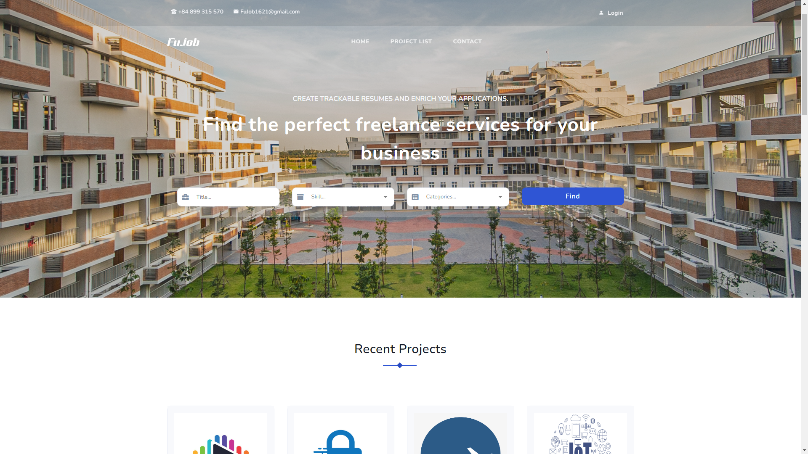
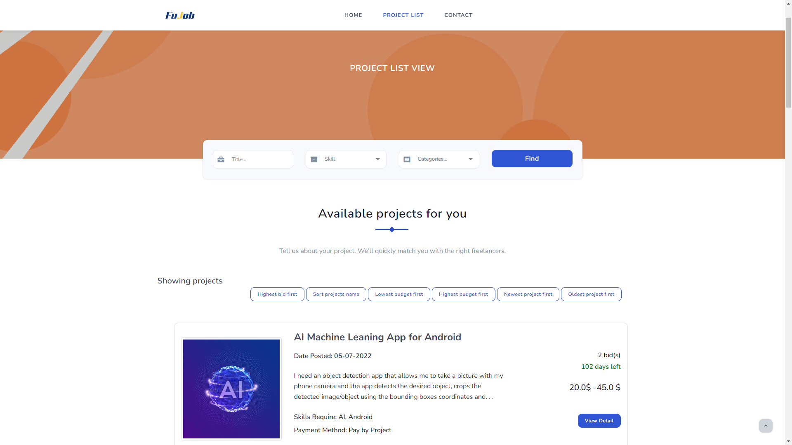
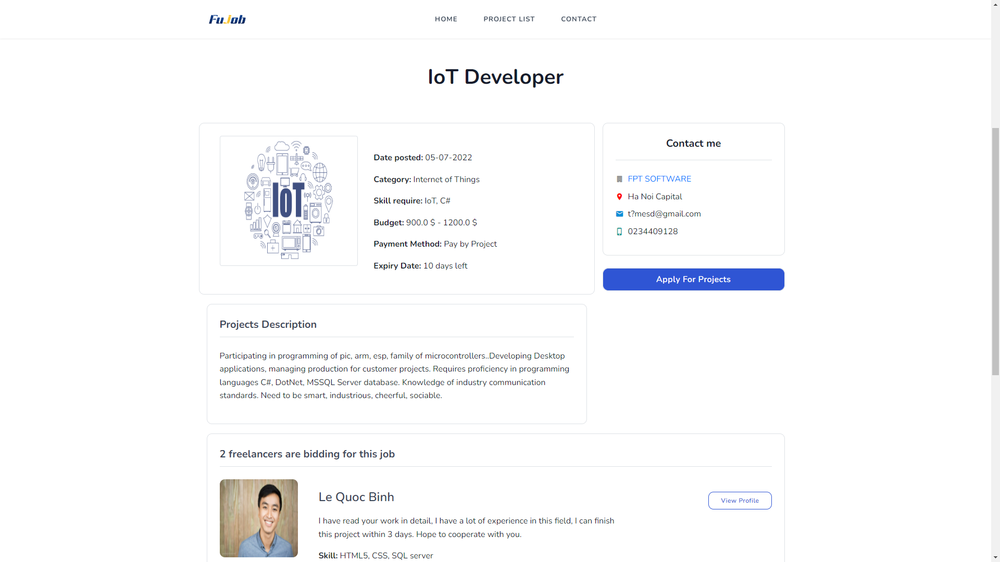
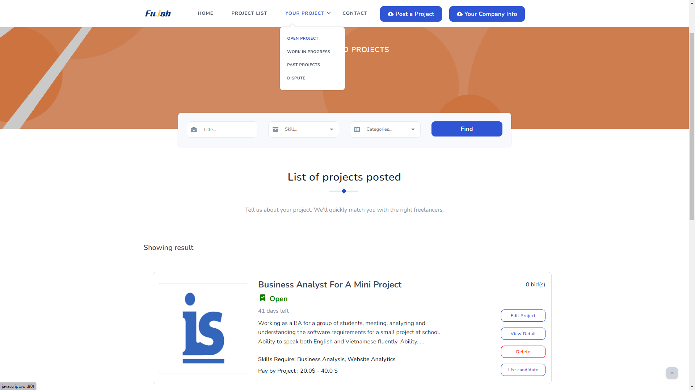
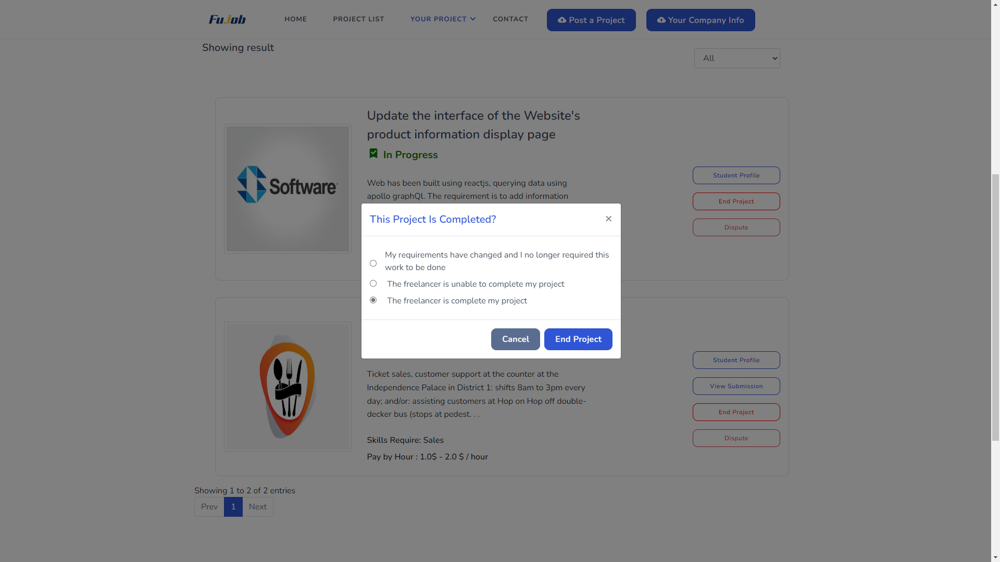
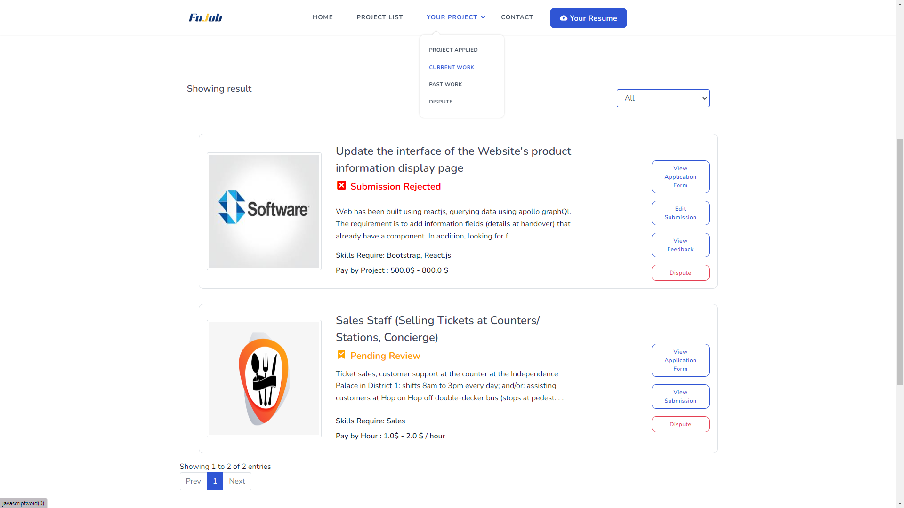
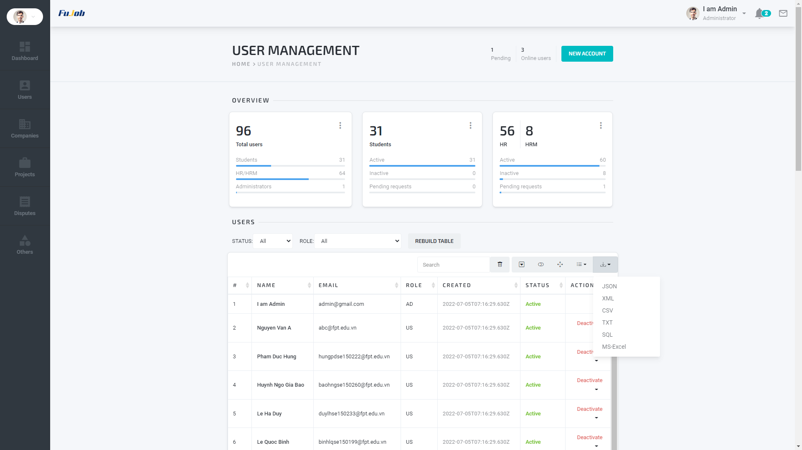

## [Live Demo](https://fujob2.azurewebsites.net/) - [Document Design](doc/SWP391_FuJob_Design.pdf) - [Document SRS](doc/SWP391_FuJob_SRS.pdf)

## Case Study

Updating

## Feature by role

- Common Role
    - Login and register account
    - Update user information
    - Reset password
    - Search and view projects
- FPT Student Role
    - Manage resume
    - Apply project
    - Manage projects applied
    - Submit work
    - Manage disputes
- Human Resources Manager Role
    - Manage company info
    - Manage human resources
- Human Resources Role
    - Post project
    - View company info
    - Manage project posted
    - View candidate
    - Manage disputes
- Admin Role
    - Updating
## Requirements
- Java - jdk11 or above
- Maven - 3.x.x
- Apache Tomcat - 10.x.x
- SQL Server

## Technology

- Frontend
    - JSP - Server Side Rendering
    - Bootstrap
    - Javascript, jQuery
- Backend
    - Servlet - Server Core
    - SQL Server 2019 - Database
- Deployment
    - Github Action - CI/CD

## Team Member

- Phạm Đức Hưng - Leader | Backend + Frontend
    - Gmail: hungpd170501@gmail.com
    - Github: https://github.com/Hungpd170501
- Huỳnh Ngô Gia Bảo | Backend + Frontend
    - Gmail:
    - Github: https://github.com/HNGB
- Lê Quốc Bình | Backend + Frontend
    - Gmail:
    - Github: https://github.com/BinhJim
- Lê Hà Duy | Backend + Frontend
    - Gmail: lehaduy20112001@gmail.com
    - Github: https://github.com/HuDery

## Project Picture

</img> &nbsp;&nbsp; </img>

</img> &nbsp;&nbsp; </img>

</img> &nbsp;&nbsp; </img>

</img> &nbsp;&nbsp; </img>

## Bug Report

Feel free to create an issue request anytime we will check it out and fix it as soon as possible. Thank You So Much.

## © 2022 FuJob - FPT University
